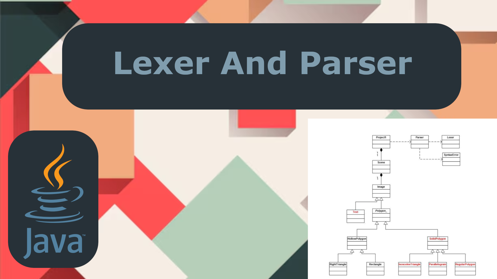

<p align="center">

</p>
    
# Lexer and Parser

## Table of Contents
- [Overview](#overview)
- [Features](#features)
- [Installation](#installation)
- [Usage](#usage)
- [Project Structure](#project-structure)
- [Contributing](#contributing)
- [License](#license)
- [Contact](#contact)

## Overview
**Lexer and Parser** is a Java Swing application designed to provide a graphical user interface (GUI) for evaluating mathematical expressions. This project demonstrates my skills in object-oriented programming, with a focus on building interactive desktop applications using Java Swing. Additionally, it integrates custom parsers and lexers to handle expression inputs, enabling the program to process and evaluate both simple and complex mathematical expressions. The GUI allows users to input expressions, visualize the results, and receive feedback on any syntax errors.

As part of my learning experience, I developed this project for CMSC 330 Advanced Programming Languages to demonstrate skills in managing complex grammar structures, file parsing, and expression evaluation in C++. 

This project serves as a showcase of my ability to:
- Apply object-oriented principles to design a flexible and scalable solution.
- Implement parsers and lexers to break down and evaluate structured input.
- Handle multiple types of expressions and manage program flow efficiently.

## Features
- Object-oriented design for maintainable and extendable code.
- Support for unary, binary, ternary, and quaternary mathematical expressions.
- Grammar and syntax rules for variable assignments and literal evaluations.
- Parser and lexer modules for structured file input handling.
- Customizable input through external files for ease of testing.
- Robust error handling and informative debugging output.

## Installation
1. Clone this repository:
    ```bash
    git clone https://github.com/yourusername/KharchenkoProject1.git
    ```
2. Navigate to the project directory:
    ```bash
    cd KharchenkoProject1
    ```
3. Compile the C++ files:
    ```bash
    g++ main.cpp -o parser
    ```
4. Run the program with an input file:
    ```bash
    ./parser input.txt
    ```

## Usage
To use this project:
1. Create a text file containing mathematical expressions following the supported syntax, such as:
    ```
    x = 10;
    y = x + 5;
    z = y * (3 - 1);
    ```
2. Run the program with your text file as an argument:
    ```bash
    ./parser expressions.txt
    ```

The program will parse and evaluate the expressions in the file and output the results.

## Project Structure

```
KharchenkoProject1/<br>
│<br>
├── src/                # Source code files<br>
│   ├── main.cpp        # Main file for parsing and evaluating<br>
│   ├── lexer.cpp       # Lexer implementation<br>
│   ├── parser.cpp      # Parser implementation<br>
│   └── ...
├── input.txt           # Sample input file with expressions<br>
├── README.md           # This README file<br>
└── Makefile            # Script to build the project<br>
```

## Contributing
Contributions are welcome! Feel free to fork this repository, make your changes, and submit a pull request.

## License
This project is licensed under the MIT License. See the [LICENSE](LICENSE) file for details.

## Contact
If you have any questions or suggestions, feel free to contact me at:  
**Your Name**  
Email: vadym.kharchenko@yahoo.com
