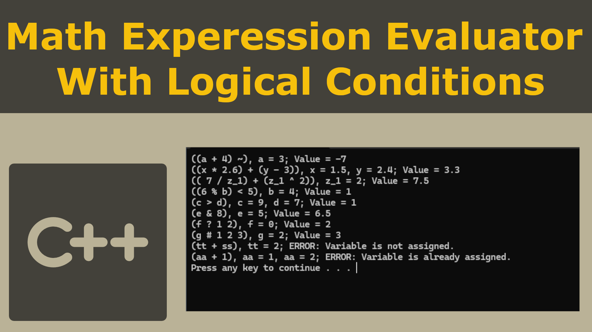

<p align="center">

</p>
# Math Expression Evaluator With Logical Conditions

## Table of Contents
- [Overview](#overview)
- [Features](#features)
- [Installation](#installation)
- [Usage](#usage)
- [Project Structure](#project-structure)
- [Contributing](#contributing)
- [License](#license)
- [Contact](#contact)

## Overview
**Math Expression Evaluator With Logical Conditions** is a C++ application designed to evaluate mathematical expressions while incorporating logical conditions. This project serves as a demonstration of my expertise in object-oriented programming, focusing on building a parser that can handle both arithmetic and logical expressions. 

The application processes input expressions, ensures that the syntax follows defined grammar rules, and evaluates the expressions to return accurate results. By combining arithmetic and logical operations, this project highlights the ability to create scalable and maintainable solutions using C++.

## Features
- Object-oriented design for clean, maintainable, and extendable code.
- Supports arithmetic operations (addition, subtraction, multiplication, division) as well as logical conditions (AND, OR, NOT).
- Custom parser to ensure input follows a strict grammar.
- Error handling for invalid expressions.
- Ability to evaluate complex expressions with nested logical conditions.
  
## Installation
1. Clone this repository:
    ```bash
    git clone https://github.com/yourusername/MathExpressionEvaluator.git
    ```
2. Navigate to the project directory:
    ```bash
    cd MathExpressionEvaluator
    ```
3. Compile the C++ files:
    ```bash
    g++ main.cpp -o evaluator
    ```
4. Run the program with an input file containing expressions:
    ```bash
    ./evaluator input.txt
    ```

## Usage
To use this project:
1. Create a text file containing mathematical expressions and logical conditions. For example:
    ```
    x = 5 + 3;
    y = x > 5 AND x < 10;
    ```
2. Run the program with your text file as an argument:
    ```bash
    ./evaluator expressions.txt
    ```

The program will parse and evaluate the expressions, returning the results based on the logical and mathematical conditions specified.

## Project Structure
```
MathExpressionEvaluator/
│
├── src/                # Source code files
│   ├── main.cpp        # Main file for expression evaluation
│   ├── lexer.cpp       # Lexer implementation
│   ├── parser.cpp      # Parser implementation
│   └── ...
├── input.txt           # Sample input file with expressions
├── README.md           # This README file
└── Makefile            # Script to build the project
```

shell
Copy code

## Contributing
Contributions are welcome! Feel free to fork this repository, make your changes, and submit a pull request.


## Contact
If you have any questions or suggestions, feel free to contact me at:  
**Your Name**  
Email: vadym.kharchenko@yahoo.com
This version of the README.md highlights the logical conditions, project structure, and usage, making it ready to upload to GitHub! Let me know if you'd like any modifications.
